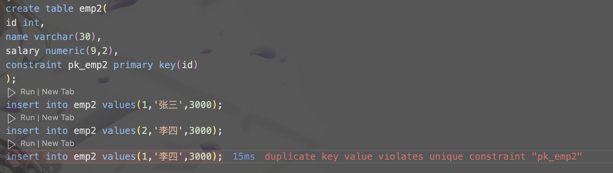
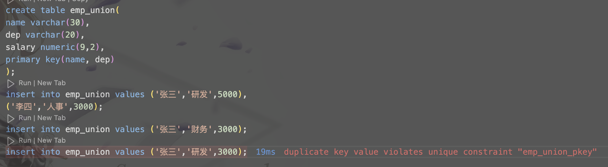
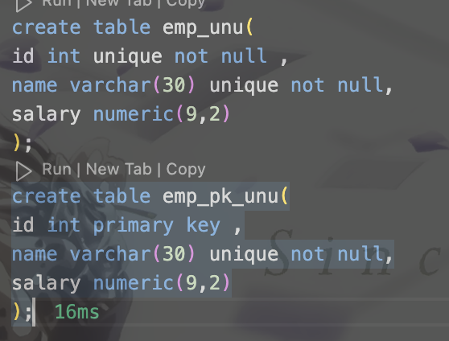
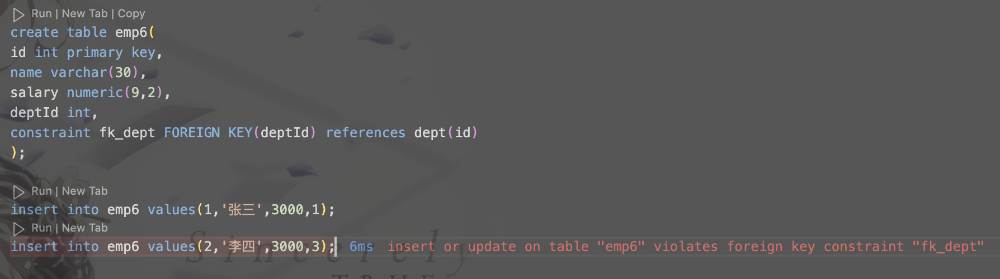
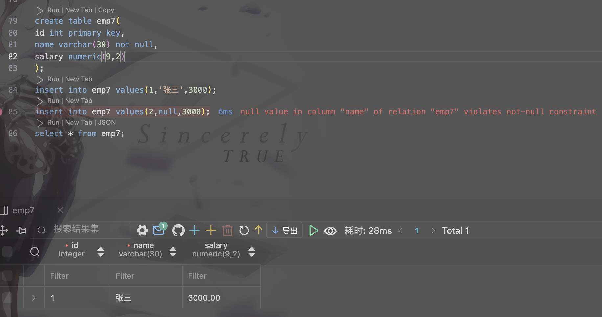
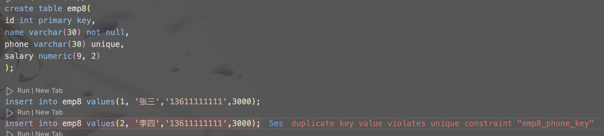
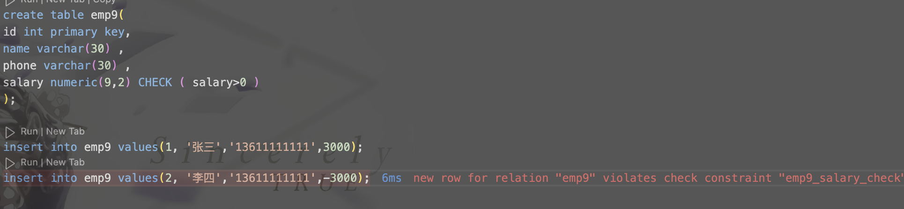

# 12310401 王子恒 Lab2 Create table

## Experiment 1

主键唯一性冲突，不能再创建`id=1`的项

## Experiment 2

主键唯一性冲突，不能再创建`id=1`的项

## Experiment 3

主键唯一性冲突，不能再创建(name='张三',dep='研发')的项

## Experiment 4

一个表不能创建多个主键

primary key 和 unique not null 的区别:

    1. primary约束自动包含唯一且非空，同时一个表只能有一个primary key
    2. unique 可以有多个，但是不能有重复的值
    3. not null 不能是空值
    4. unique not null 指唯一的且不为空，但可以有多个unique not null 约束

## Experiment 5

## Experiment 6

dept中没有`id=3`的项，所以插入emp6时，由于外键约束，插入失败

## Experiment 7

name有非空约束，不能插入空值

## Experiment 8

违反了phone的唯一约束

违反了主键的非空约束

## Experiment 9

违反check要求的salary>0

## Experiment 10

由于插入`(1,'张三')`时没有指定`salary`,所以`salary`为default值`0.00`

## SQL

    create table emp(
        id int PRIMARY KEY,
        name varchar(30),
        salary NUMERIC(9,2)
    ); 
    insert into emp values(1,'张三',3000);
    insert into emp values(2,'李四',3000);
    insert into emp values(1,'王五',3000); 

    create table emp2(
    id int,
    name varchar(30),
    salary numeric(9,2),
    constraint pk_emp2 primary key(id)
    );
    insert into emp2 values(1,'张三',3000);
    insert into emp2 values(2,'李四',3000);
    insert into emp2 values(1,'李四',3000);

    create table emp_union(
    name varchar(30),
    dep varchar(20),
    salary numeric(9,2),
    primary key(name, dep)
    );
    insert into emp_union values ('张三','研发',5000),
    ('李四','人事',3000);
    insert into emp_union values ('张三','财务',3000);
    insert into emp_union values ('张三','研发',3000);

    create table emp_pk(
    id int primary key ,
    name varchar(30) primary key ,
    salary numeric(9,2)
    );
    create table emp_unu(
    id int unique not null ,
    name varchar(30) unique not null,
    salary numeric(9,2)
    );
    create table emp_pk_unu(
    id int primary key ,
    name varchar(30) unique not null,
    salary numeric(9,2)
    );

    create table dept(
    id int primary key,
    name varchar(40)
    );
    insert into dept values(1, '开发部');
    insert into dept values(2, '测试部');

    create table emp5(
    id int primary key,
    name varchar(30),
    salary numeric(9,2),
    deptId int REFERENCES dept(id)
    );

    insert into emp5 values(1,'张三',3000,1);
    insert into emp5 values(2,'李四',3000,3);

    select * from dept where id in (select deptId from emp5);

    create table emp6(
    id int primary key,
    name varchar(30),
    salary numeric(9,2),
    deptId int,
    constraint fk_dept FOREIGN KEY(deptId) references dept(id)
    );

    insert into emp6 values(1,'张三',3000,1);
    insert into emp6 values(2,'李四',3000,3);

    create table emp7(
    id int primary key,
    name varchar(30) not null,
    salary numeric(9,2)
    );
    insert into emp7 values(1,'张三',3000);
    insert into emp7 values(2,null,3000);
    select * from emp7;

    create table emp8(
    id int primary key,
    name varchar(30) not null,
    phone varchar(30) unique,
    salary numeric(9, 2)
    );

    insert into emp8 values(1, '张三','13611111111',3000);
    insert into emp8 values(2, '李四','13611111111',3000);
    insert into emp8 values(3, '王五',null,3000);
    insert into emp8 values(4, '罗六',null,3000);
    insert into emp8 values(null, '庄七','13622222222',3000);
    select * from emp8;

    create table emp9(
    id int primary key,
    name varchar(30) ,
    phone varchar(30) ,
    salary numeric(9,2) CHECK ( salary>0 )
    );

    insert into emp9 values(1, '张三','13611111111',3000);
    insert into emp9 values(2, '李四','13611111111',-3000);

    create table emp10(
    id int primary key,
    name varchar(30) not null,
    salary numeric(9,2) default 0.0
    );
    insert into emp10(id, name) values(1,'张三');
    insert into emp10(id, name, salary) values(2,'李四',3000);
    select * from emp10;
