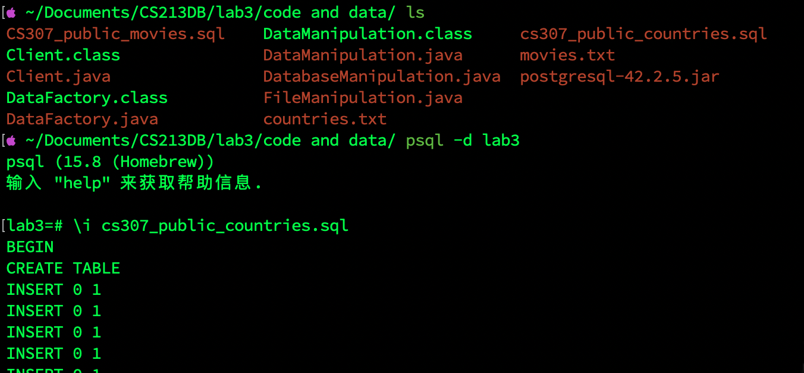
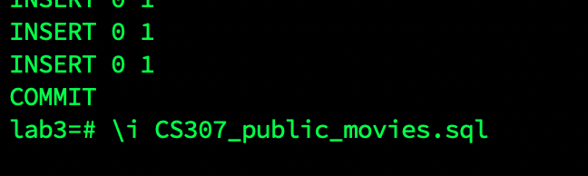
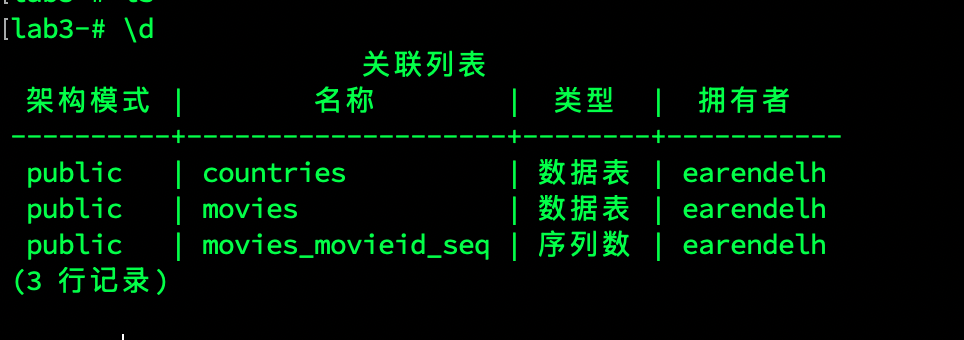
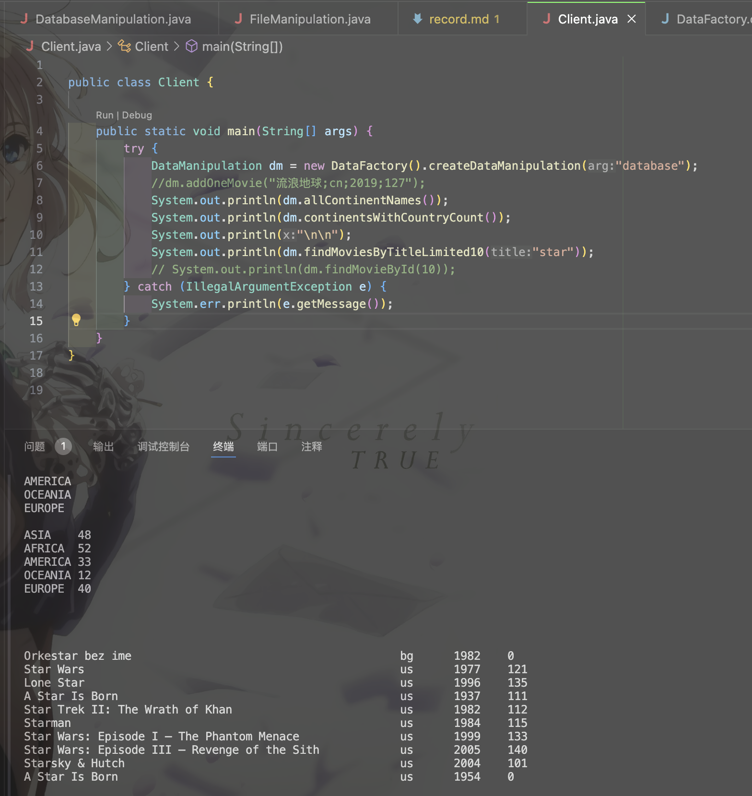
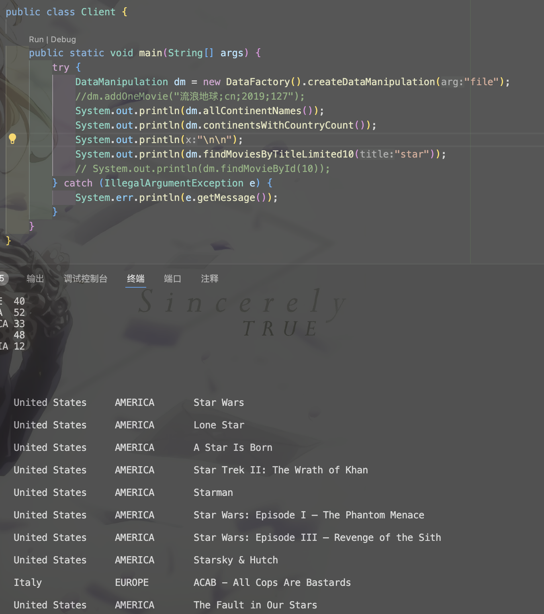
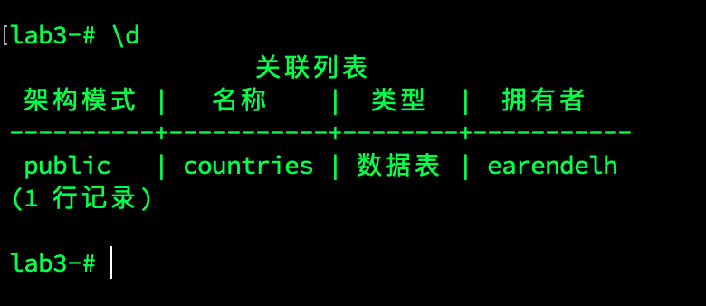
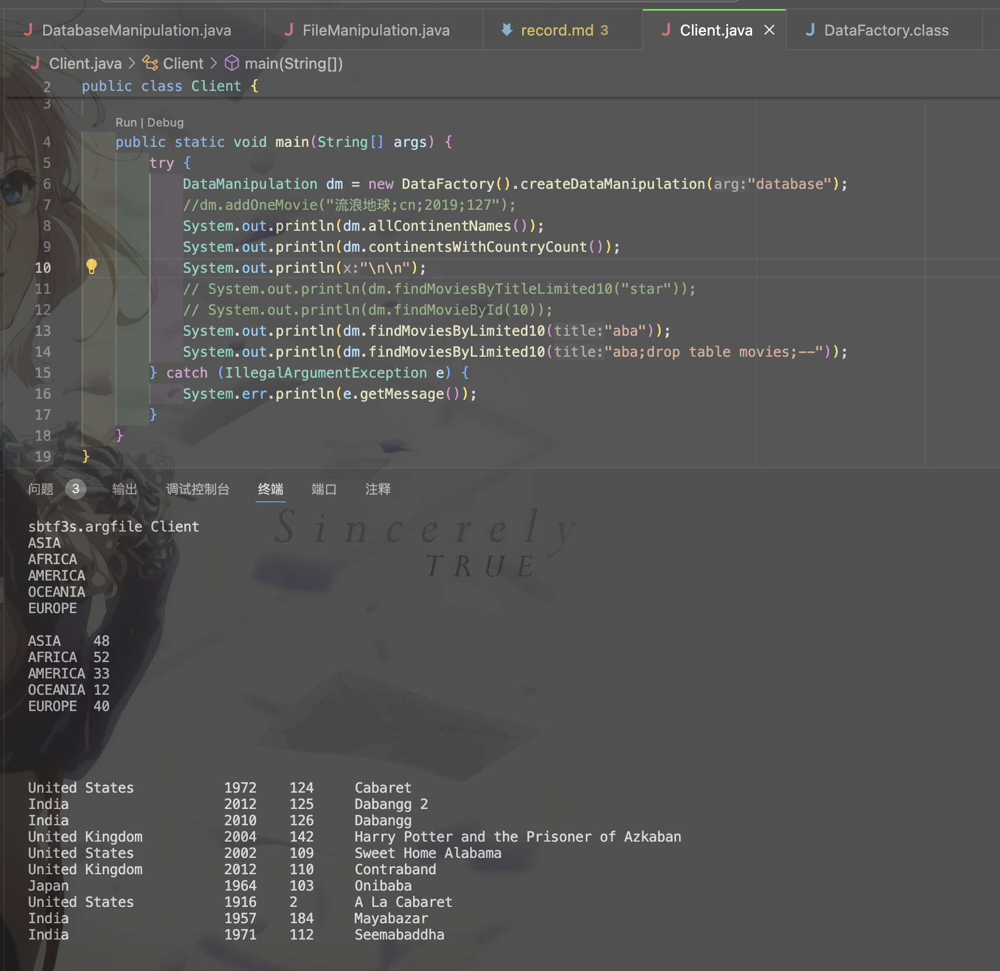
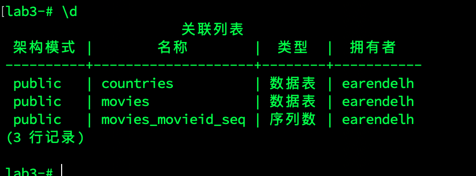

# Lab3 record

SID: 12310401
name: Ziheng Wang





## 1. findmoviesbytitlelimite10

### database:

```java
 @Override
    public String findMoviesByTitleLimited10(String title) {
        getConnection();
        StringBuilder sb = new StringBuilder();
        String sql = "select * from movies where lower(title) like '%'||?||'%' limit 10;";
        try {
            PreparedStatement preparedStatement = con.prepareStatement(sql);
            preparedStatement.setString(1, title);
            resultSet = preparedStatement.executeQuery();
            while (resultSet.next()) {
                sb.append(String.format("%-50s", resultSet.getString("title"))+ "\t");
                sb.append(resultSet.getString("country")+ "\t");
                sb.append(resultSet.getInt("year_released") + "\t");
                sb.append(resultSet.getInt("runtime") + "\t");
                sb.append(System.lineSeparator());
            }
        } catch (SQLException e) {
            e.printStackTrace();
        } finally {
            closeConnection();
        }
        return sb.toString();
    }

```



### file:

```java
@Override
    public String findMoviesByTitleLimited10(String title) {
        Map<String, String> countryMap = getCountryMap();
        List<FullInformation> list = new ArrayList<>();
        String line;
        String[] splitArray;
        int titleIndex = 1, countryIndex = 2, runTimeIndex = 4, runTime;
        int count = 0;
        try (BufferedReader bufferedReader = new BufferedReader(new FileReader("movies.txt"))) {
            bufferedReader.readLine();
            while ((line = bufferedReader.readLine()) != null) {
                splitArray = line.split(";");
                if (splitArray[titleIndex].toLowerCase().contains(title.toLowerCase())) {
                    if (!"null".equals(splitArray[runTimeIndex])) {
                        runTime = Integer.parseInt(splitArray[runTimeIndex]);
                        line = runTime + "\t" + countryMap.get(splitArray[countryIndex].trim()) + "\t"
                                + splitArray[titleIndex] + "\n";
                        list.add(new FullInformation(runTime, line));
                        count++;
                    }
                }
                if (count == 10) {
                    break;
                }
            }
        } catch (IOException e) {
            e.printStackTrace();
        }
        String result="";
        for(FullInformation f : list) {
            result+=f.information+"\n";
            
        }
        return result;
    }
```



## 2. sql injection

### use statement




### use prepared statement




Thus we can see that the prepared statement is safer than the statement.